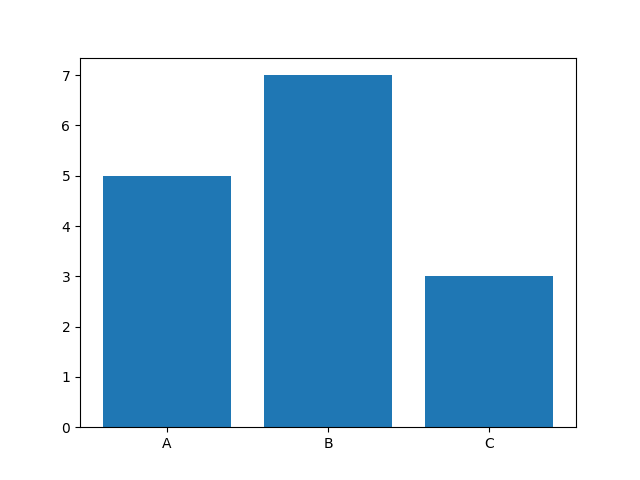

# Task: Plotting with Matplotlib

## Theory
In this task, you will learn how to create a grouped bar chart using Matplotlib to visualize the number of games for each genre across different platforms.

The `bar` function in `matplotlib` creates a bar chart, where each bar represents a value, and bars are placed along the x-axis. This function is useful for comparing quantities across categories.

Here's a breakdown of how to use `plt.bar()` and its main parameters:
```python
import matplotlib.pyplot as plt

# Data for bar chart
categories = ['A', 'B', 'C']
values = [5, 7, 3]

# Create bar chart
plt.bar(categories, values)
plt.show()
```

Resulting in the following plot:


If we look at the syntax, the key parameters are:
```python
plt.bar(x, height, width=0.8, color='blue', label='Label')
```

- x: The positions (usually on the x-axis) where each bar will be placed.
- height: The height of each bar, which usually represents the values or counts you want to display.
- width (optional): Controls the width of each bar (default is 0.8). Adjust to make bars narrower or wider.
- color (optional): Sets the color of the bars. Can be a single color for all bars or a list of colors if you want each bar a different color.
- label (optional): Adds a label to the bars, which is useful when creating a legend

We will use a slightly different approach from a basic `plt.bar`, using `df.plot()` function:
- **DataFrame Plotting**: It uses the plot method directly on the pivot_table DataFrame instead of manually specifying values through plt.bar. This is convenient as it handles indexing and plotting for each column automatically.

- **Color Mapping**: Using `[colors(i) for i in range(len(pivot_table.columns))]` applies a color to each platform dynamically. In contrast, a simpler approach would apply a single color to all bars or require manually specifying colors for each.

- **Grouped Bar Plot**: By specifying kind='bar', it automatically creates a grouped bar plot for each genre, allowing for easy visualization of platform comparisons within each genre.

### Task:
-  Use the bar function to plot bars for each platform within each genre.
